# linux-network-security-lab
## Lab SOC - Firewall Debian (nftable), Suricata et Wazuh

# 1. Présentation

## Objectif du laboratoire

La mise en place d'un environnement de laboratoire dédié à la cybersécurité permet d'expérimenter des architectures réseau réalistes, de déployer des mécanismes de protection et d'analyser le comportement d'un système face à différentes techniques d'attaque.

Ce laboratoire a pour objectif de concevoir et mettre en œuvre une architecture réseau sécurisée intégrant un pare-feu Linux, un système de détection d'intrusion réseau (IDS) ainsi qu'une solution de supervision et de corrélation des événements (SIEM).

L'environnement permet notamment de :

* mettre en œuvre une politique de filtrage réseau ;
* contrôler les flux entrants et sortants grâce aux mécanismes NAT ;
* détecter des activités suspectes à l'aide d'un IDS ;
* centraliser et analyser les événements de sécurité ;
* reproduire des scénarios d'attaque depuis une machine externe afin de valider les mécanismes de défense.

Ce projet constitue également une approche plus bas niveau de la sécurité réseau, en complément des solutions intégrées telles que pfSense utilisées dans certains projets universitaires. L'utilisation directe de Netfilter via `nftables` permet de mieux comprendre le fonctionnement interne d'un pare-feu Linux et la gestion des flux réseau.

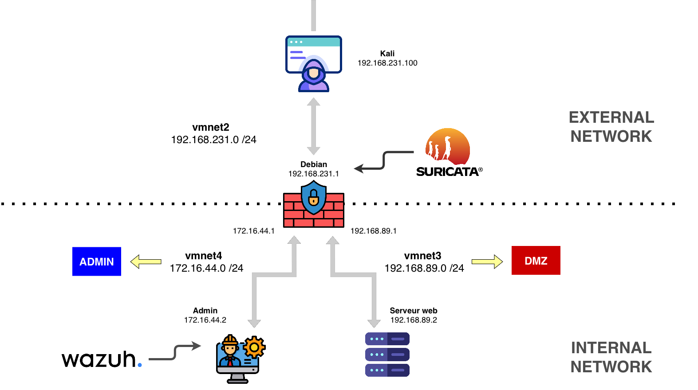

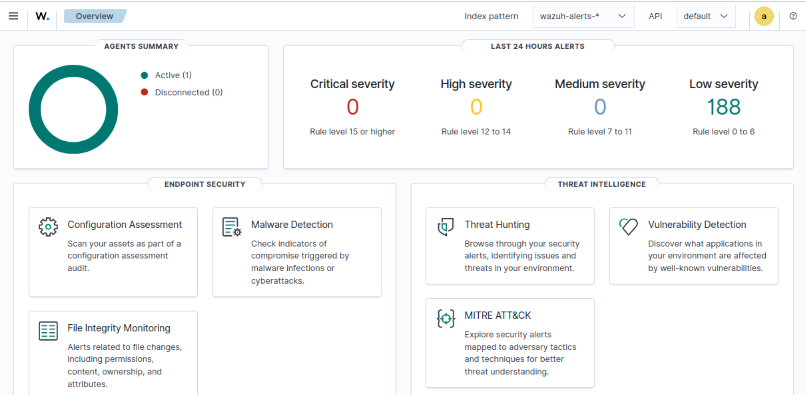

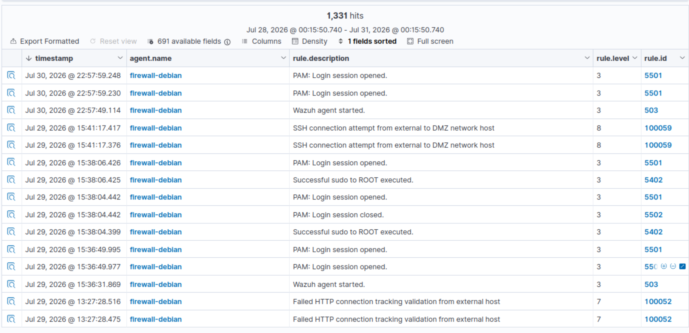

---

## Machine hôte et virtualisation

Le laboratoire est déployé dans un environnement virtualisé avec la configuration matérielle suivante :

* Processeur : Apple Silicon M2 Pro (architecture ARM64)
* Mémoire vive : 16 Go RAM
* Stockage : 512 Go SSD

La solution de virtualisation utilisée est **VMware Fusion**, choisie pour les raisons suivantes :

* compatibilité avec macOS ;
* disponibilité gratuite des fonctionnalités nécessaires au laboratoire ;
* possibilité d'associer plusieurs interfaces réseau virtuelles à une même machine virtuelle, permettant de reproduire une architecture réseau segmentée.

---

## Technologies utilisées

### Sécurité réseau

* **nftables / Netfilter** : mise en œuvre du pare-feu Linux, gestion du filtrage réseau et des mécanismes NAT (SNAT/DNAT).
* **Suricata** : système de détection d'intrusion réseau (IDS) déployé sur l'interface externe du pare-feu afin d'identifier les activités suspectes.
* **Nmap** : outil utilisé pour réaliser des phases de reconnaissance réseau et valider la détection des scans par l'IDS.
* **Scapy** : génération de paquets réseau personnalisés afin de tester les mécanismes de filtrage et le suivi des connexions (*connection tracking*).

### Supervision et journalisation

* **Wazuh** : solution SIEM utilisée pour centraliser les événements de sécurité, exploiter les alertes Suricata et analyser les journaux système du pare-feu.
* **rsyslog** : collecte et transfert des journaux générés par le pare-feu vers la plateforme de supervision.
* **jq** : outil permettant d'exploiter et de filtrer les fichiers JSON générés par Suricata.

### Systèmes utilisés

* **Kali Linux** : machine externe utilisée pour simuler des activités offensives (reconnaissance, génération de trafic réseau et tests d'intrusion).
* **Linux Desktop** : machine d'administration utilisée pour la gestion et la supervision du laboratoire.
* **Linux Server** : serveur hébergeant un service Web accessible depuis l'extérieur via une règle de translation d'adresse (DNAT).

---

## Compétences mises en œuvre

Ce laboratoire a permis de mettre en pratique les compétences suivantes :

* conception d'une architecture réseau sécurisée ;
* mise en place d'une politique de filtrage réseau avec un pare-feu Linux ;
* configuration du routage et des adressages IP statiques ;
* déploiement de mécanismes NAT (SNAT et DNAT) ;
* mise en place de Suricata en IDS
* centralisation et analyse de journaux de sécurité ;
* création de scénarios de validation permettant de vérifier l'efficacité des mécanismes de défense ;
* exploitation du suivi des connexions (*connection tracking*) pour renforcer les règles de sécurité réseau.

# 2. Architecture

## Schéma réseau

L'architecture du laboratoire repose sur une segmentation en plusieurs zones réseau afin de reproduire un environnement proche d'une infrastructure d'entreprise :

* **Zone externe (WAN)** : réseau utilisé pour simuler des machines provenant d'Internet. Cette zone contient la machine Kali utilisée pour les tests offensifs.
* **Zone serveur (DMZ)** : réseau isolé contenant le serveur Web exposé vers l'extérieur via une règle de DNAT.
* **Zone administration** : réseau dédié à l'administration et à la supervision de l'infrastructure, contenant le serveur Wazuh.

Le pare-feu Debian constitue le point central de l'architecture. Il assure :

* le routage entre les différentes zones ;
* le filtrage des communications avec `nftables` ;
* la translation d'adresses réseau (SNAT/DNAT) ;
* la détection des activités suspectes avec Suricata ;
* la remontée des événements de sécurité vers Wazuh.

---

## Description des machines

### Kali Linux

Machine positionnée dans la zone externe du laboratoire.

Elle est utilisée pour simuler un poste attaquant et réaliser différents scénarios de test :

* reconnaissance réseau avec Nmap ;
* analyse des services exposés ;
* génération de trafic réseau personnalisé avec Scapy ;
* validation des règles de filtrage du pare-feu.

---

### Debian Firewall

Machine centrale de l'architecture assurant les fonctions de sécurité réseau.

Elle assure plusieurs rôles :

* routage entre les différents réseaux ;
* filtrage réseau avec `nftables` basé sur Netfilter ;
* gestion du NAT entrant (DNAT) et sortant (SNAT) ;
* génération et collecte de journaux système ;
* détection réseau avec Suricata positionné sur l'interface externe ;
* transmission des événements de sécurité vers Wazuh via l'agent Wazuh.

---

### Ubuntu Desktop (Administration)

Machine dédiée à l'administration et à la supervision.

Elle héberge :

* Wazuh en mode Single Node ;
* les connexions SSH permettant l'administration des machines internes.

---

### Ubuntu Server

Serveur applicatif placé dans la zone DMZ.

Il héberge un service Web simple rendu accessible depuis l'extérieur via une règle de DNAT configurée sur le pare-feu.

---

# 3. Configuration VMware et adressage réseau

## Création des réseaux virtuels

Trois réseaux virtuels VMware ont été créés afin de reproduire les différentes zones de l'architecture :

| Réseau VMware | Adresse réseau   | Rôle                |
| ------------- | ---------------- | ------------------- |
| vmnet 2       | 192.168.231.0/24 | Zone externe (WAN)  |
| vmnet 3       | 192.168.89.0/24  | Zone serveur (DMZ)  |
| vmnet 4       | 172.16.44.0/24   | Zone administration |

---

## Attribution des interfaces réseau et des adresses IP

| Machine         | Interface réseau | Adresse IP      |
| --------------- | ---------------- | --------------- |
| Kali            | vmnet 2          | 192.168.231.100 |
| Debian Firewall | vmnet 2          | 192.168.231.1   |
| Debian Firewall | vmnet 3          | 192.168.89.1    |
| Debian Firewall | vmnet 4          | 172.16.44.1     |
| Ubuntu Desktop  | vmnet 4          | 172.16.44.2     |
| Ubuntu Server   | vmnet 3          | 192.168.89.2    |

Cette segmentation permet d'isoler les différents rôles du laboratoire et de contrôler précisément les communications entre les zones via le pare-feu Debian.

---

# 4. Routage

## Routage du pare-feu Debian

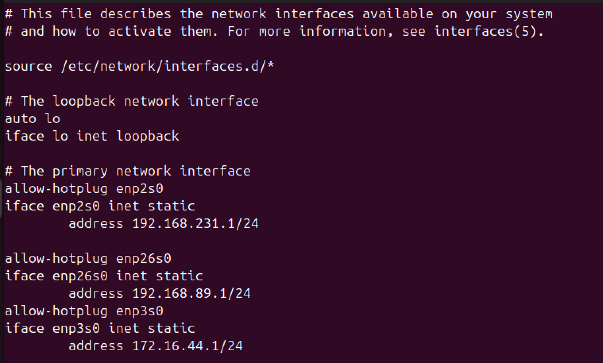

Le pare-feu Debian assure le routage inter-réseaux. Chaque réseau étant directement attaché à une interface physique virtuelle, les routes correspondantes sont automatiquement connues par le système.

| Réseau destination | Interface                                         |
| ------------------ | ------------------------------------------------- |
| 192.168.231.0/24   | vmnet 2 (`enp2s0` du point de vue de la machine)  |
| 192.168.89.0/24    | vmnet 3 (`enp26s0`du point de vue de la machine)  |
| 172.16.44.0/24     | vmnet 4 (`enp3s0`du point de vue de la machine)   |

---

## Routage machine d'administration

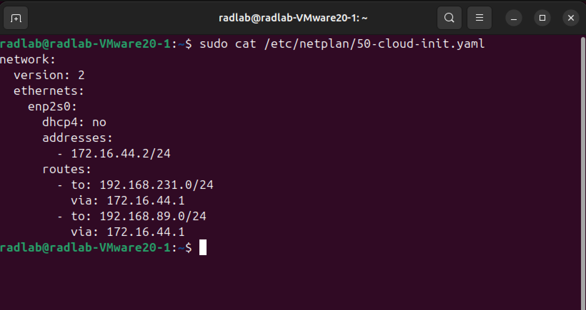

La machine d'administration utilise le pare-feu Debian comme passerelle pour accéder aux autres zones :

| Réseau destination | Passerelle  |
| ------------------ | ----------- |
| 192.168.231.0/24   | 172.16.44.1 |
| 192.168.89.0/24    | 172.16.44.1 |

---

## Routage serveur Web

Le serveur Web utilise le pare-feu Debian comme passerelle afin de permettre les communications nécessaires avec les autres réseaux :

| Réseau destination | Passerelle   |
| ------------------ | ------------ |
| 192.168.231.0/24   | 192.168.89.1 |
| 172.16.44.0/24     | 192.168.89.1 |

# 5. Déploiement du pare-feu

**Annexe :** `nftables.conf`

Le pare-feu Debian constitue l'élément central de l'architecture réseau. Il assure les fonctions de routage entre les différentes zones, le filtrage réseau, la traduction d'adresses (NAT), la journalisation des événements ainsi que la transmission des informations nécessaires à la supervision (logs et alertes).

L'ensemble des règles de sécurité est implémenté avec **nftables**, l'outil permettant de manipuler le pare-feu Linux **Netfilter**.

---

## Politique de sécurité

La politique de sécurité mise en place a pour objectif de garantir :

* la disponibilité des services nécessaires au fonctionnement du laboratoire ;
* l'isolation des différentes zones réseau ;
* un accès contrôlé à l'ensemble du réseau interne depuis la machine d'administration.

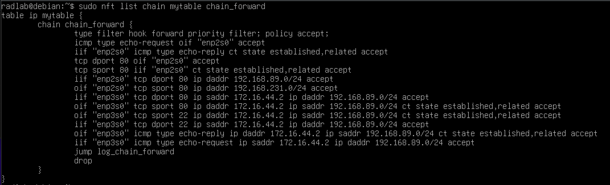

Le filtrage repose sur une approche restrictive : seuls les flux explicitement autorisés par la politique de sécurité sont acceptés.

La politique de filtrage définie est la suivante :

### Pare-feu Debian

Le pare-feu doit pouvoir :

* effectuer des requêtes ICMP (*ping*) vers toutes les zones, y compris l'extérieur ;
* accéder aux services Web internes et externes.

Note : Les règles concernant le connexion tracking (Http et SSH n'ont pas été mis en place sur les hook inputs relatifs au pare-feu)

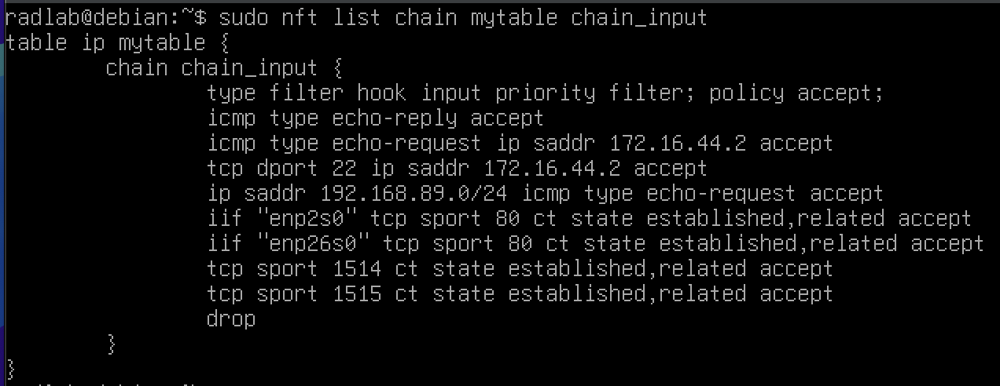

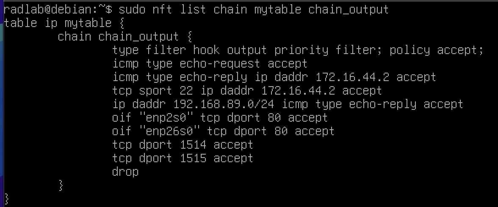

### Accès depuis l'extérieur

Le réseau externe est considéré comme non fiable.

Les machines externes peuvent :

* accéder au service HTTP du serveur Web interne via l'adresse publique du pare-feu.

En revanche :

* les accès directs vers la zone d'administration sont interdits ;
* les accès directs vers le serveur Web sont interdits ;
* les accès non explicitement autorisés vers les réseaux internes sont bloqués.

### Zones internes (administration et serveur)

Les zones internes sont autorisées à :

* effectuer des requêtes ICMP vers l'extérieur ;
* accéder aux services Web externes sur le port 80.

Ces communications ne permettent cependant pas d'autoriser des connexions entrantes depuis l'extérieur.

### Machine d'administration

La machine d'administration dispose de droits spécifiques afin de permettre la gestion du laboratoire.

Elle est autorisée à :

* établir une connexion SSH vers le pare-feu Debian ;
* établir une connexion SSH vers le serveur interne.

Les connexions SSH initiées depuis les autres zones vers la machine d'administration sont interdites.

---

# Translation d'adresses (NAT)

Le laboratoire utilise les mécanismes de traduction d'adresses proposés par Netfilter afin de permettre l'accès aux services Web et aux communications sortantes.

## DNAT

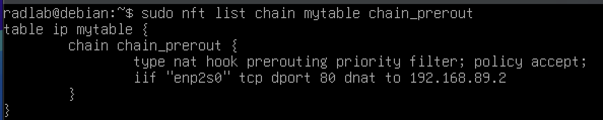

Le mécanisme de **DNAT** (*Destination Network Address Translation*) permet de rendre disponible le service Web interne vers l'extérieur.

Les machines externes accèdent au service HTTP en utilisant l'adresse du pare-feu `192.168.231.1:80` sur l'interface externe `vmnet2`.

Le pare-feu redirige ensuite cette connexion vers le serveur Web interne `192.168.89.2:80`

Ainsi, le service Web est accessible depuis l'extérieur tout en restant isolé dans son réseau interne.

---

## SNAT

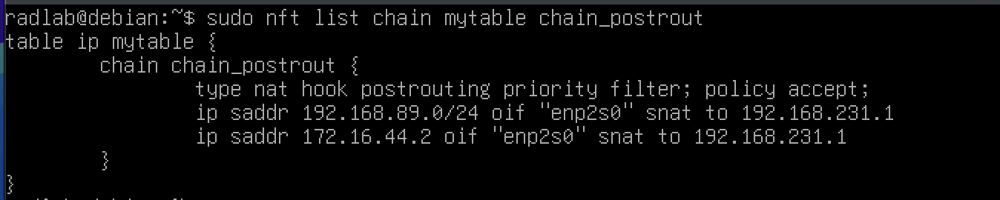

Le mécanisme de **SNAT** (*Source Network Address Translation*) permet aux machines internes d'accéder aux services externes.

Lorsqu'une machine interne initie une connexion vers l'extérieur, le pare-feu modifie son adresse source par sa propre adresse sur l'interface externe `192.168.231.1`

Cette modification permet aux réponses provenant de l'extérieur d'être correctement retournées vers la machine interne à l'origine de la connexion.

---

# Suivi des connexions (*Connection Tracking*)

Le pare-feu utilise le mécanisme de **Connection Tracking** de Netfilter afin d'appliquer un filtrage à états (*stateful firewall*).

Une connexion n'est considérée comme autorisée que si elle correspond à un état attendu par la politique de sécurité.

Les règles suivantes sont notamment appliquées :

* Une réponse SSH (`sport 22`) vers la machine d'administration est autorisée uniquement si elle correspond à une connexion déjà établie.

* Une réponse HTTP (`sport 80`) vers la machine d'administration ou le serveur interne est autorisée uniquement si elle correspond à une connexion déjà établie.

* Une réponse ICMP (`sport 80`) vers la machine d'administration ou le serveur interne est autorisée uniquement si elle correspond à une connexion déjà établie.

Ce mécanisme permet de bloquer les paquets inattendus ou ne correspondant pas à une communication légitime.

---

# Journalisation

Tous les paquets correspondant à une tentative de connexion interdite (flux non prévu par la politique de filtrage ou échec du *Connection Tracking*) sont journalisés.

Chaque événement est associé à un préfixe spécifique afin de :

* identifier rapidement l'origine et la nature du trafic ;
* différencier un refus de politique (`DENY_*`) d'un échec du suivi de connexion (`CT-ERR_*`) ;
* permettre la création de règles de détection personnalisées dans Wazuh.

Les préfixes utilisés sont les suivants :

| Préfixe                                 | Description                                                                                     |
| --------------------------------------- | ----------------------------------------------------------------------------------------------- |
| `CT-ERR_FROM-EXTERNAL_ICMP-REP_`        | Réponse ICMP provenant de l'extérieur échouant au Connection Tracking                           |
| `CT-ERR_FROM-EXTERNAL_HTTP-REP_`        | Réponse HTTP provenant de l'extérieur échouant au Connection Tracking                           |
| `CT-ERR_FROM-DMZ-TO-ADMIN_HTTP-REP_`    | Réponse HTTP provenant du serveur interne vers l'administration échouant au Connection Tracking |
| `CT-ERR_FROM-DMZ-TO-ADMIN_ICMP-REP_`    | Réponse ICMP provenant du serveur interne vers l'administration échouant au Connection Tracking |
| `CT-ERR_FROM-DMZ-TO-ADMIN_SSH-REP_`     | Réponse SSH provenant du serveur interne vers l'administration échouant au Connection Tracking  |
| `DENY_FROM-EXTERNAL-TO-ADMIN_HTTP-REQ_` | Requête HTTP de l'extérieur vers l'administration                                               |
| `DENY_FROM-DMZ-TO-ADMIN_HTTP-REQ_`      | Requête HTTP du serveur interne vers l'administration                                           |
| `DENY_FROM-EXTERNAL-TO-ADMIN_SSH-REQ_`  | Requête SSH de l'extérieur vers l'administration                                                |
| `DENY_FROM-EXTERNAL-TO-DMZ_SSH-REQ_`    | Requête SSH de l'extérieur vers le serveur interne                                              |
| `DENY_FROM-DMZ-TO-ADMIN_SSH-REQ_`       | Requête SSH du serveur interne vers l'administration                                            |
| `DENY_FROM-EXTERNAL-TO-ADMIN_ICMP-REQ_` | Requête ICMP de l'extérieur vers l'administration                                               |
| `DENY_FROM-EXTERNAL-TO-DMZ_ICMP-REQ_`   | Requête ICMP de l'extérieur vers le serveur interne                                             |
| `DENY_FROM-DMZ-TO-ADMIN_ICMP-REQ_`      | Requête ICMP du serveur interne vers l'administration                                           |

Les journaux générés par le pare-feu sont collectés par **rsyslog** et enregistrés dans le fichier `kern.log`. Ils seront ensuite transmis à Wazuh par l'intermédiaire de l'agent installé sur le pare-feu.

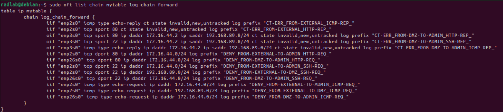

Ces préfixes seront également utilisés lors des tests de validation afin de vérifier le bon fonctionnement de la chaîne de détection.

---

# Communication avec Wazuh

L'agent Wazuh installé sur le pare-feu est chargé de transmettre :

* les journaux collectés par rsyslog, notamment ceux générés par nftables ;
* les alertes générées par Suricata.

Pour communiquer avec Wazuh Manager situé sur la machine d'administration, l'agent doit pouvoir contacter les ports suivants :

| Port | Utilisation                                               |
| ---- | --------------------------------------------------------- |
| 1514 | Transmission des événements vers Wazuh Manager            |
| 1515 | Enregistrement initial de l'agent auprès de Wazuh Manager |

Les règles suivantes sont appliquées sur le pare-feu :

* les connexions sortantes du pare-feu vers les ports 1514 et 1515 sont autorisées ;
* les connexions entrantes associées à ces communications sont autorisées uniquement lorsqu'elles appartiennent à une connexion déjà établie.

Note : La règle concernant le port 1515 n'est nécessaire que lors de l'enregistrement initial de l'agent.

---

# Note technique : architecture Netfilter

Le pare-feu Linux basé sur Netfilter utilise plusieurs points d'accroche (*hooks*) traversés par les paquets lors de leur traitement.

Les principaux hooks utilisés dans cette configuration sont :

* **prerouting** : phase de pré-traitement des paquets avant le routage. Les règles de DNAT y sont appliquées ;
* **postrouting** : phase de post-traitement après le routage. Les règles de SNAT y sont appliquées ;
* **input** : filtrage des connexions destinées directement au pare-feu ;
* **output** : filtrage des connexions initiées par le pare-feu ;
* **forward** : filtrage des paquets traversant le pare-feu entre plusieurs réseaux.

Les règles de journalisation sont regroupées dans une chaîne indépendante appelée à la fin du hook `forward` (son nom est chain_forward). Cette organisation permet de séparer la logique de filtrage de la logique de journalisation et améliore la lisibilité de la configuration.

# 6. Déploiement de Suricata (IDS)

Afin de compléter les mécanismes de protection assurés par le pare-feu, **Suricata** est déployé en tant que **système de détection d'intrusion réseau (IDS)** sur la machine Debian.

Contrairement au pare-feu, qui applique une politique de filtrage, Suricata analyse le contenu des paquets transitant sur le réseau afin d'identifier des comportements suspects ou des signatures d'attaques connues. Cette approche permet d'obtenir une visibilité plus fine sur l'activité réseau et d'enrichir la supervision de sécurité.

---

## Positionnement dans l'architecture

Suricata est configuré en mode **IDS** et écoute le trafic circulant sur l'interface externe (`enp2s0` / `vmnet2`).

Ce positionnement permet d'observer les communications entre la zone externe et l'infrastructure protégée, notamment :

* les scans réseau réalisés avec Nmap ;
* les signatures d'attaques issues des règles de détection.
* les anomalies lors de tentatives de connexion ;

---

## Configuration

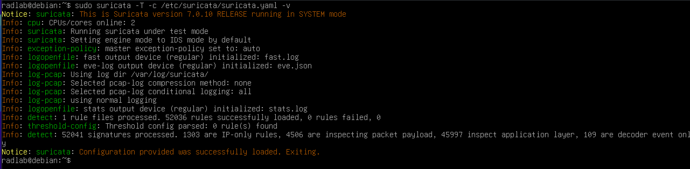

Les principaux paramètres de configuration sont les suivants :

| Paramètre                       | Valeur                                             |
| ------------------------------- | -------------------------------------------------- |
| Réseaux internes (`HOME_NET`)   | `172.16.44.0/24`, `192.168.89.0/24`                |
| Réseau externe (`EXTERNAL_NET`) | Tous les réseaux hors `HOME_NET`                   |
| Interface d'écoute              | `enp2s0` du poinr de vue de la machine (`vmnet2`)  |
| Source des règles               | **Emerging Threats Open (ET Open)**                |

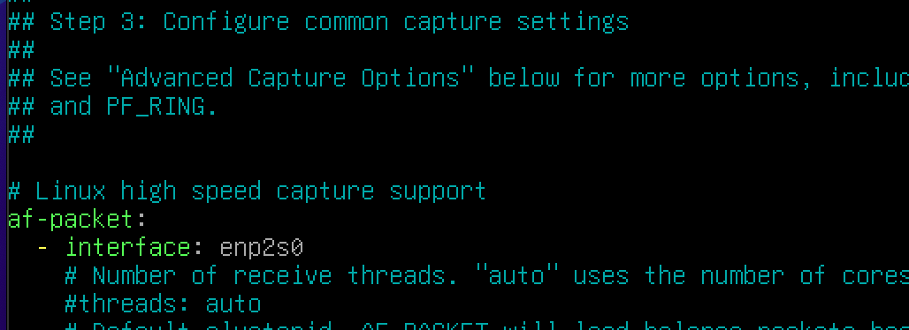

Les règles **Emerging Threats Open** constituent une base de signatures reconnue et régulièrement mise à jour, permettant de détecter de nombreux comportements malveillants sans avoir à développer de règles personnalisées.

---

## Journaux générés

Suricata produit deux journaux principaux :

| Fichier                      | Contenu                                                                                                 |
| ---------------------------- | ------------------------------------------------------------------------------------------------------- |
| `/var/log/suricata/fast.log` | Journal texte des alertes générées.                                                                     |
| `/var/log/suricata/eve.json` | Journal au format JSON contenant les alertes ainsi que les métadonnées associées aux événements réseau. |

Le fichier `eve.json` est utilisé tout au long du laboratoire, car il fournit des informations détaillées (horodatage, adresses IP, protocole, signature, niveau de sévérité, etc.) exploitables par Wazuh.

Pour faciliter l'analyse de ce fichier JSON, les requêtes sont réalisées avec l'outil **jq**, qui permet de filtrer et d'extraire rapidement les informations pertinentes.

Cette journalisation constitue le point d'entrée des événements Suricata dans la chaîne de supervision mise en œuvre avec Wazuh.

# 7. Déploiement de Wazuh (SIEM)

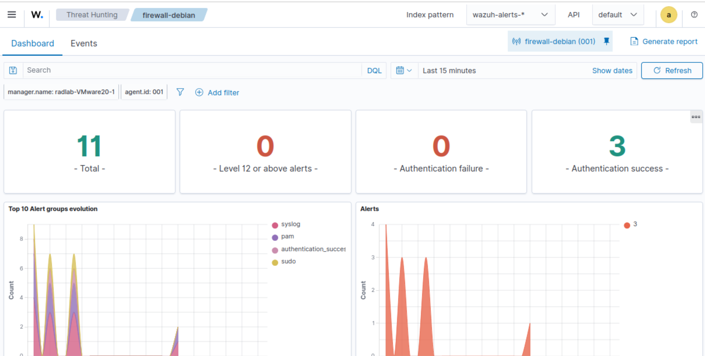

Afin de centraliser les événements de sécurité générés par le laboratoire, le SIEM **Wazuh** est déployée sur la machine d'administration.

Wazuh permet de collecter, indexer, corréler et visualiser les événements provenant du pare-feu et de Suricata. Il constitue ainsi le point central de supervision du laboratoire.

---

## Architecture

Le laboratoire utilise une architecture **Single Node**, dans laquelle l'ensemble des composants Wazuh est installé sur une seule machine.

Les services déployés sont les suivants :

| Service             | Rôle                                                                                    |
| ------------------- | --------------------------------------------------------------------------------------- |
| **Wazuh Manager**   | Réception des événements envoyés par les agents                                         |
| **Wazuh Indexer**   | Stockage et indexation des événements de sécurité.                                      |
| **Wazuh Dashboard** | Interface Web de supervision et d'analyse des événements.                               |

Un **agent Wazuh** est installé sur le pare-feu Debian.

Il transmet au Manager :

* les journaux système collectés par **rsyslog**, notamment ceux générés par `nftables` ;
* les alertes produites par **Suricata**.

---

## Archivage des événements

Par défaut, Wazuh ne conserve pas les événements qui ne déclenchent aucune règle de détection.

Afin de faciliter l'analyse et le développement de règles personnalisées, l'archivage complet des événements a été activé.

Cette configuration repose sur trois étapes :

1. activation de l'option `logall_json` dans `ossec.conf` afin de conserver tous les événements dans `/var/ossec/logs/archives/archives.json`

2. configuration de **Filebeat** afin d'envoyer ces archives vers **Wazuh Indexer** (filebeat est un collecteur);

3. création d'un index dédié dans **Wazuh Dashboard** afin de consulter les événements bruts depuis l'interface Web.

Cette approche permet d'analyser les journaux avant même la création de règles de détection et facilite le développement de nouvelles alertes.

Note : Les alertes Suricata ne nécessitent pas cette configuration, car elles sont déjà enregistrées automatiquement dans `alerts.json`.

---

## Création de règles personnalisées

**Annexe :** `local_rules.xml`

Les journaux générés par le pare-feu ne produisent pas d'alertes nativement dans Wazuh.

Des règles personnalisées ont donc été développées dans `/var/ossec/etc/rules/local_rules.xml`

Chaque règle analyse les préfixes de journalisation définis dans `nftables` (par exemple `DENY_*` ou `CT-ERR_*`) afin de transformer les événements réseau en alertes exploitables.

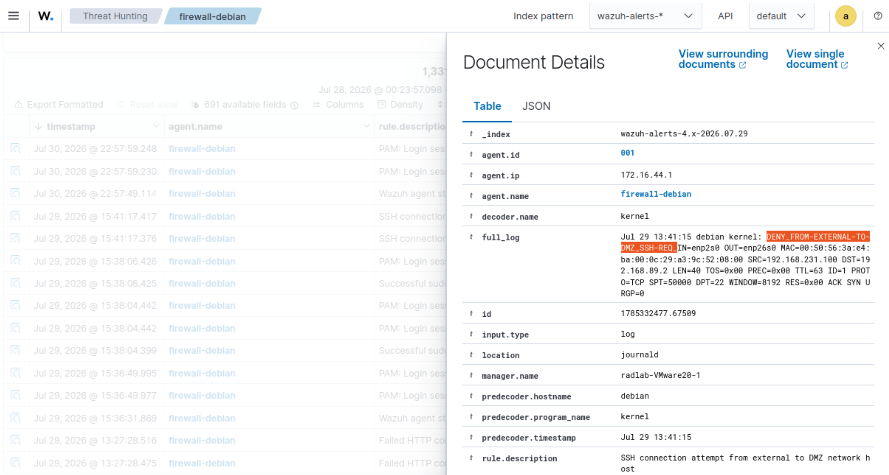

Cette approche permet :

* d'identifier rapidement les connexions interdites ;
* de distinguer un refus de politique de sécurité d'une anomalie liée au *Connection Tracking* ;
* d'attribuer un niveau de criticité adapté à chaque événement.

---

## Niveaux de sévérité

Les règles personnalisées utilisent les niveaux de gravité proposés par Wazuh afin de hiérarchiser les événements détectés.
Ci dessous les niveau d'alertes correspondant aux évènements du pare-feu (On identifie l'évènement avec le préfix ajouté par le pare-feu lors de la journalisation de ces évènements)

| Événement                             | Niveau |
| ------------------------------------- | -----: |
| CT-ERR_FROM-EXTERNAL_ICMP-REP_        |  **7** |
| CT-ERR_FROM-EXTERNAL_HTTP-REP_        |  **7** |
| CT-ERR_FROM-DMZ-TO-ADMIN_HTTP-REP_    |  **7** |
| CT-ERR_FROM-DMZ-TO-ADMIN_ICMP-REP_    |  **7** |
| CT-ERR_FROM-DMZ-TO-ADMIN_SSH-REP_     | **10** |
| DENY_FROM-EXTERNAL-TO-ADMIN_HTTP-REQ_ |  **6** |
| DENY_FROM-EXTERNAL-TO-ADMIN_SSH-REQ_  | **10** |
| DENY_FROM-EXTERNAL-TO-ADMIN_ICMP-REQ_ |  **6** |
| DENY_FROM-EXTERNAL-TO-DMZ_SSH-REQ_    |  **8** |
| DENY_FROM-EXTERNAL-TO-DMZ_ICMP-REQ_   |  **5** |
| DENY_FROM-DMZ-TO-ADMIN_HTTP-REQ_      |  **6** |
| DENY_FROM-DMZ-TO-ADMIN_SSH-REQ_       | **10** |
| DENY_FROM-DMZ-TO-ADMIN_ICMP-REQ_      |  **6** |

Ces règles permettent d'obtenir une supervision cohérente avec la politique de sécurité mise en œuvre sur le pare-feu et facilitent l'identification des événements nécessitant une investigation.

# 8. Test et validation

**Annexe :** `Tests_de_validation.pdf`

Une série de tests a été réalisée afin de valider le bon fonctionnement de l'ensemble de l'architecture mise en place.

Les procédures détaillées ainsi que les résultats obtenus sont disponibles dans le document **`Tests_de_validation.pdf`**.

Afin de faciliter la correspondance entre ce document et le README, chaque scénario conserve le même numéro de test dans les tableaux ci-dessous.

Trois catégories de validation ont été réalisées :

* validation de la journalisation du pare-feu et de la génération d'alertes Wazuh ;
* validation de la détection d'intrusion par Suricata et de la remontée des alertes associées ;
* validation des fonctionnalités réseau du pare-feu (NAT, accès autorisés et administration).

---

## Validation des journaux du pare-feu et des alertes Wazuh

Ces tests permettent de vérifier la chaîne complète de supervision :

**nftables → rsyslog → agent Wazuh → Wazuh Manager → alerte personnalisée**

Ils valident notamment :

* la génération des journaux par les règles de filtrage ;
* la collecte des événements par rsyslog ;
* la transmission des événements par l'agent Wazuh ;
* le déclenchement des règles personnalisées associées aux préfixes de journalisation.

| Préfixe de journalisation             | N° Test |
| ------------------------------------- | ------: |
| CT-ERR_FROM-EXTERNAL_ICMP-REP_        |       1 |
| CT-ERR_FROM-EXTERNAL_HTTP-REP_        |       2 |
| CT-ERR_FROM-DMZ-TO-ADMIN_HTTP-REP_    |       3 |
| CT-ERR_FROM-DMZ-TO-ADMIN_ICMP-REP_    |       4 |
| CT-ERR_FROM-DMZ-TO-ADMIN_SSH-REP_     |       5 |
| DENY_FROM-EXTERNAL-TO-ADMIN_HTTP-REQ_ |       6 |
| DENY_FROM-DMZ-TO-ADMIN_HTTP-REQ_      |       7 |
| DENY_FROM-EXTERNAL-TO-ADMIN_SSH-REQ_  |       8 |
| DENY_FROM-DMZ-TO-ADMIN_SSH-REQ_       |       9 |
| DENY_FROM-EXTERNAL-TO-ADMIN_ICMP-REQ_ |      10 |
| DENY_FROM-EXTERNAL-TO-DMZ_ICMP-REQ_   |      11 |
| DENY_FROM-DMZ-TO-ADMIN_ICMP-REQ_      |      12 |
| DENY_FROM-EXTERNAL-TO-DMZ_SSH-REQ_    |      13 |

---

## Validation de la détection d'intrusion par Suricata

Ces tests valident la capacité de Suricata à identifier des comportements suspects sur l'interface externe du pare-feu ainsi que la remontée des alertes associées dans Wazuh.

| Scénario                                            | N° Test |
| --------------------------------------------------- | ------: |
| Suricata : détection d'un scan Nmap                 |      14 |
| Suricata : déclenchement de la règle ET Open 210048 |      15 |

---

## Validation des fonctionnalités réseau du pare-feu

Ces tests permettent de vérifier le comportement réseau attendu conformément à la politique de sécurité définie :

| Fonctionnalité                                                    | N° Test |
| ----------------------------------------------------------------- | ------: |
| DNAT : accès HTTP depuis Kali vers le serveur Web                 |      16 |
| SNAT : accès HTTP depuis le serveur Web vers un service externe   |      17 |
| Connexion SSH de la machine d'administration vers le pare-feu     |      18 |
| Connexion SSH de la machine d'administration vers le serveur Web  |      19 |
| Connexion HTTP de la machine d'administration vers le serveur Web |      20 |

L'ensemble de ces scénarios permet de confirmer le bon fonctionnement de l'architecture :

* les flux autorisés sont accessibles ;
* les flux interdits sont correctement bloqués ;
* les événements de sécurité sont journalisés ;
* les alertes sont générées et visibles dans Wazuh.
